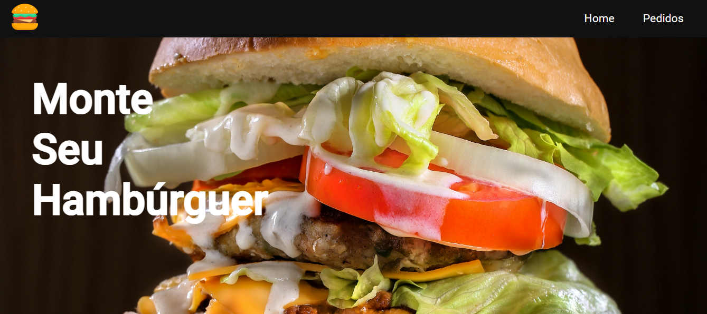

<h1 align="center"> 🍔 Monte Seu Hambúrguer </h1>



#
Monte Seu Hambúrguer é um site onde o usuário escolhe os itens, como, por exemplo, o tipo de pão, carne, etc., que irão compor o seu hambúrguer. Os pedidos são enviados para uma Dashboard onde é possível administrá-los.
#
## Tecnologias e técnicas utilizadas

- HTML
- CSS
- JavaScript
- Vue.js

Métodos

Reutilização de layout

CSS global e CSS scoped

Componentização
 
Criação de API com JSON server

Integração com o back-end

#

## Demonstração

Demonstração em vídeo: https://youtu.be/Q8hRV327_W0

#
<div align="center">

[<br><sub>Thaiane</sub>](https://github.com/thaianealm) 

<br/>


&nbsp contatothaianealm@gmail.com &nbsp&nbsp&nbsp

<a href="https://www.linkedin.com/in/thaiane-a-lima-51506522a/">LinkedIn</a>&nbsp&nbsp&nbsp

<a href="https://www.instagram.com/thaianealm_/">Instagram</a>

</div>

<hr/>

<br/>

#
## make-your-burger-vue.js
<br/>

## Project setup
```
npm install
```

### Compiles and hot-reloads for development
```
npm run serve
```

### Compiles and minifies for production
```
npm run build
```

### Customize configuration
See [Configuration Reference](https://cli.vuejs.org/config/).
